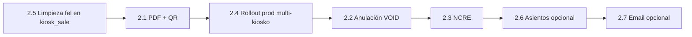

# Facturación electrónica (FEL) — Fase 2

Plan de evolución del módulo unificado `tax_invoice` después de la **Fase 1** (emisión FACT, bitácora, XML certificado, POS / Online / Contabilidad).

Documentos relacionados:

- [TAX-INVOICE-FEL.md](./TAX-INVOICE-FEL.md) — arquitectura actual (Fase 1)
- [TAX-INVOICE-PRUEBAS.md](./TAX-INVOICE-PRUEBAS.md) — guía de pruebas Fase 1
- [KIOSKO-PILOTO-VILLALOBOS-PRUEBAS.md](./KIOSKO-PILOTO-VILLALOBOS-PRUEBAS.md) — piloto POS + FEL por kiosko (#46)

---

## Qué ya existe (Fase 1 — baseline)

| Capacidad | Estado |
|-----------|--------|
| Tabla unificada `tax_invoice` + `tax_invoice_line` | ✅ |
| Orígenes: `KIOSK_SALE`, `ONLINE_SALE`, `MANUAL` | ✅ |
| Certificación INFILE (FACT), reintento 24 h | ✅ |
| Bitácora `tax_invoice_attempt` | ✅ |
| XML certificado en BD (`fel_certified_xml`) + descarga | ✅ |
| POS: NIT automático; CF opcional | ✅ |
| FEL por **establecimiento** vía `locations.fel_establishment_code` (piloto kiosko) | ✅ |
| Estados: `DRAFT`, `SKIPPED`, `CERTIFIED`, `FAILED` | ✅ |
| Permiso `CONTABILIDAD.FACTURAS.ANULAR` en rutas (sin API aún) | ⚠️ reservado |

**Limitación explícita Fase 1:** INFILE no entrega PDF; solo `xml_certificado`. La representación gráfica para el cliente queda para Fase 2.

---

## Objetivos Fase 2

1. Entregar al cliente/receptor un **comprobante legible** (PDF o HTML imprimible) con **QR SAT**, generado desde datos certificados.
2. Soportar **anulación FEL** y **notas de crédito (NCRE)** ligadas a la factura original.
3. Preparar **producción fiscal**: `test-mode=false`, `required=true`, credenciales reales por emisor.
4. Reducir deuda técnica: dejar de duplicar `fel_*` en `kiosk_sale`.
5. (Opcional según prioridad) Integración contable automática y envío por correo.

---

## Alcance por entregable

### 2.1 Representación gráfica (PDF / HTML + QR)

**Problema:** El XML certificado es válido para SAT pero no es amigable para cajero/cliente.

**Solución propuesta:**

| Componente | Descripción |
|------------|-------------|
| `TaxInvoicePrintService` (nuevo) | Genera HTML/PDF desde `TaxInvoiceEntity` + líneas; opcionalmente parsea campos clave del `fel_certified_xml`. |
| QR SAT | URL o payload según especificación vigente (UUID + datos emisor/receptor/monto/fecha). |
| API | `GET /api/tax-invoices/{id}/pdf` o `/print-html` |
| UI POS | Botón «Descargar factura PDF» en pantalla de éxito (además del XML). |
| UI Contabilidad | Mismo botón en detalle de factura. |
| UI Online | Descarga desde modal post-emisión. |

**Notas técnicas:**

- No depende de API PDF de INFILE (no existe en manual).
- Plantilla alineada a formato CUEROGLAM / requisitos SAT (logo, frases FEL, serie/número, UUID).
- Cache opcional: guardar PDF generado en S3 o columna `fel_print_pdf` (evaluar tamaño).

**Criterio de aceptación:**

- [ ] Factura `CERTIFIED` → PDF descargable con serie, número, UUID y QR escaneable.
- [ ] POS y Contabilidad muestran enlace tras certificación OK.

---

### 2.2 Anulación FEL (`VOID`)

**Problema:** Hoy `status=VOID` está reservado pero no hay flujo de anulación ante SAT/INFILE.

**Solución propuesta:**

| Item | Detalle |
|------|---------|
| API | `POST /api/tax-invoices/{id}/void` con motivo |
| Permiso | `CONTABILIDAD.FACTURAS.ANULAR` |
| Reglas | Solo `CERTIFIED`; ventana y reglas INFILE (anulación mismo día / plazo según tipo doc) |
| Bitácora | Nuevo intento en `tax_invoice_attempt` con `action=VOID` |
| UI | Botón en detalle Contabilidad; confirmación con motivo |

**Impacto en ventas:**

- POS / Online: definir si anular factura implica devolución de inventario (fuera de alcance mínimo → solo anulación fiscal + estado local).

**Criterio de aceptación:**

- [ ] Factura certificada anulable desde Contabilidad con permiso.
- [ ] Estado pasa a `VOID`; UUID de anulación registrado si INFILE lo devuelve.
- [ ] Reintento de emisión sobre venta anulada → comportamiento documentado (nueva factura vs bloqueo).

---

### 2.3 Notas de crédito (NCRE)

**Problema:** Devoluciones parciales/totales requieren NCRE referenciando la FACT original.

**Solución propuesta:**

| Item | Detalle |
|------|---------|
| `document_type` | `NCRE` además de `FACT` |
| `FelFactXmlBuilder` | Extender o `FelNcreXmlBuilder` con referencia a UUID/serie/número de factura origen |
| Origen | `source_type` nuevo ej. `KIOSK_RETURN`, `ONLINE_RETURN`, `MANUAL_NCRE` |
| UI | Desde detalle de factura: «Emitir nota de crédito» (monto parcial o total) |
| POS devoluciones | Enlazar con módulo Kioscos → Devoluciones cuando exista flujo completo |

**Criterio de aceptación:**

- [ ] NCRE certificada referencia FACT origen.
- [ ] Bitácora de intentos igual que FACT.
- [ ] Listado Contabilidad filtra por `document_type`.

---

### 2.4 Producción fiscal multi-kiosko

**Contexto:** Piloto Villa Lobos (#46) usa credenciales prueba CUEROGLAM y `fel.emission.test-mode=true`.

**Fase 2 rollout:**

| Tarea | Descripción |
|-------|-------------|
| Catálogo | Cada kiosko con `fel_establishment_code`, dirección FEL en `locations` |
| Config | Credenciales producción INFILE por emisor (env vars, no en repo) |
| Switch | `fel.emission.test-mode=false`, `fel.emission.required=true` en prod |
| Validación | Checklist por kiosko (mismo que piloto: NIT, CF, XML, establecimiento correcto) |
| Monitoreo | Alertas sobre `FAILED` / tasa de `SKIPPED` |

Ver [KIOSKO-PILOTO-VILLALOBOS-PRUEBAS.md](./KIOSKO-PILOTO-VILLALOBOS-PRUEBAS.md) sección go-live como plantilla por punto de venta.

---

### 2.5 Limpieza `kiosk_sale.fel_*`

**Problema:** Fase 1 mantiene columnas `fel_*` en `kiosk_sale` sincronizadas por compatibilidad.

**Solución:**

1. Frontend POS y reportes leen solo `tax_invoice` vía `invoice_id`.
2. Migración de datos verificada (backfill ya en `migration-tax-invoice.sql`).
3. Script `migration-drop-kiosk-sale-fel-columns.sql` (Fase 2).
4. Eliminar `syncKioskSaleFelFields` cuando no haya consumidores.

**Criterio de aceptación:**

- [ ] Ningún código de producción lee `kiosk_sale.fel_uuid` directamente.
- [ ] Columnas legacy eliminadas sin romper POS.

---

### 2.6 Asientos contables automáticos (opcional)

**Descripción:** Al certificar FACT/NCRE, generar borrador de asiento (cuenta ingreso, IVA, CXC).

| Item | Detalle |
|------|---------|
| Tabla | `accounting_entry` / enlace `tax_invoice_id` |
| Trigger | Post-`CERTIFIED` en `TaxInvoiceService` |
| UI | Contabilidad → ver asiento sugerido / exportar |

**Prioridad:** media — puede ir en Fase 2b si contabilidad no está lista.

---

### 2.7 Envío por correo (opcional)

- Campo `email` en factura / venta.
- Tras `CERTIFIED`: adjuntar PDF (2.1) vía servicio de correo existente o SMTP configurado.
- Plantilla «Su factura electrónica CUEROGLAM».

---

## Fuera de alcance Fase 2 (Fase 3+)

- Facturas de exportación / otros tipos DTE distintos de FACT/NCRE.
- Integración con ERP externo distinto a Fossiles Core.
- Firma digital masiva offline.
- Cola asíncrona de certificación (hoy es síncrona en request).

---

## Orden sugerido de implementación

| Semana | Entregable |
|--------|------------|
| 1 | PDF/HTML + QR; botones descarga POS y Contabilidad |
| 2 | Rollout prod kiosko #46 → siguientes puntos; `required=true` |
| 3 | Anulación FEL + permisos ANULAR |
| 4 | NCRE manual desde Contabilidad |
| 5 | Limpieza columnas legacy; asientos/email si aplica |

---

## Migraciones y scripts previstos (Fase 2)

| Script | Propósito |
|--------|-----------|
| `migration-tax-invoice-void-fields.sql` | Campos anulación: `voided_at`, `void_reason`, `fel_void_uuid` |
| `migration-tax-invoice-ncre-reference.sql` | `referenced_tax_invoice_id`, `document_type` índices |
| `migration-drop-kiosk-sale-fel-columns.sql` | Eliminar duplicados en `kiosk_sale` |
| (opcional) `migration-tax-invoice-print-cache.sql` | Cache PDF si se almacena en BD |

---

## API REST prevista (delta Fase 2)

| Método | Ruta | Descripción |
|--------|------|-------------|
| GET | `/api/tax-invoices/{id}/pdf` | PDF representación gráfica |
| GET | `/api/tax-invoices/{id}/print` | HTML imprimible |
| POST | `/api/tax-invoices/{id}/void` | Anulación FEL |
| POST | `/api/tax-invoices/{id}/credit-note` | Crear y certificar NCRE |
| POST | `/api/tax-invoices/{id}/send-email` | Enviar PDF al receptor (opcional) |

Endpoints Fase 1 sin cambios: listado, manual, retry, `certified-xml`.

---

## Permisos

| Permiso | Fase 1 | Fase 2 |
|---------|--------|--------|
| `CONTABILIDAD.FACTURAS.VER` | ✅ | ✅ |
| `CONTABILIDAD.FACTURAS.CREAR` | ✅ | ✅ + NCRE |
| `CONTABILIDAD.FACTURAS.CERTIFICAR` | ✅ | ✅ |
| `CONTABILIDAD.FACTURAS.ANULAR` | definido en rutas | ✅ implementar API void |

---

## Checklist go-live Fase 2 (producción fiscal)

1. [ ] Asesor INFILE confirma frases FEL definitivas (tipo 1 + 4 para CUEROGLAM; no tipo 2 con GEN).
2. [ ] Credenciales producción en variables de entorno (no en git).
3. [ ] `fel.emission.test-mode=false` y `required=true` en servidor prod.
4. [ ] Todos los kioskos activos con `fel_establishment_code` en catálogo.
5. [ ] PDF + QR probado con factura real de prueba en prod.
6. [ ] Procedimiento de anulación documentado para Contabilidad.
7. [ ] Monitoreo diario: `SELECT status, COUNT(*) FROM tax_invoice WHERE created_at >= CURRENT_DATE GROUP BY status`.

---

## Referencias INFILE / SAT

- Manuales en carpeta `FEL/` del repositorio o documentación del asesor.
- Certificación devuelve `xml_certificado` (Base64) — base para PDF y archivo legal.
- Reintento: mismo `fel_transaction_id` dentro de 24 h (ya implementado Fase 1).

---

## Resumen ejecutivo

**Fase 1** resolvió *emitir y guardar* el DTE (FACT) desde POS, Online y Contabilidad, con trazabilidad y XML.

**Fase 2** resuelve *operación fiscal completa*: comprobante para el cliente (PDF/QR), corrección/anulación (VOID/NCRE), paso a producción multi-establecimiento, y retiro de duplicados técnicos en `kiosk_sale`.

Para dudas de pruebas actuales, seguir [TAX-INVOICE-PRUEBAS.md](./TAX-INVOICE-PRUEBAS.md). Para el piloto kiosko Villa Lobos, [KIOSKO-PILOTO-VILLALOBOS-PRUEBAS.md](./KIOSKO-PILOTO-VILLALOBOS-PRUEBAS.md).
